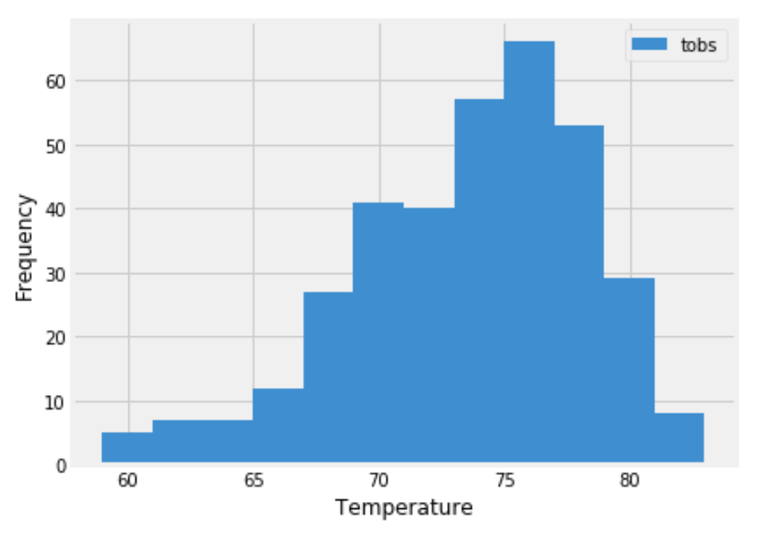
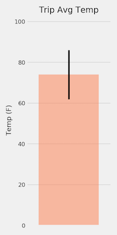

# SQLAlchemy Homework - Surfs Up!

### Files in this Repository
1. climate_starter.ipynb -- a Jupyter Notebook with the main scripts to run analysis 
2. application.py ( and requirements.txt) -- a flask application to pull data from the db into json
3. README.md -- this file

#### Directories in this Repository
1. Images -- holds images from this readme and also plots from analysis
2. Resources -- sqllite database and .csv data files. 

#### Background

This repository explorse some climate analysis on a vacation area (Honolulu). The following outlines the project capabilities

## Step 1 - Climate Analysis and Exploration

Python and SQLAlchemy were used to do basic climate analysis and data exploration of a provided climate database. All of the following analysis was completed using SQLAlchemy ORM queries, Pandas, and Matplotlib.

*  The provided [starter notebook](climate_starter.ipynb) and [hawaii.sqlite](Resources/hawaii.sqlite) files were used to complete  climate analysis and data exploration.

* A start date, 2017-07-23, and end date were selected for a trip. Vacation range is approximately 3-15 days total.

* SQLAlchemy `create_engine` was used  to connect to your sqlite database.

*  SQLAlchemy `automap_base()`  was used to reflect your tables into classes and save a reference to those classes called `Station` and `Measurement`.

### Precipitation Analysis
This analsysis includes 
* A query to retrieve the last 12 months of precipitation data.

* Selecting  only the `date` and `prcp` values.

* Loading the query results into a Pandas DataFrame and set the index to the date column.

* Sorting the DataFrame values by `date`.

* Plotting the results using the DataFrame `plot` method.

  

* Using Pandas to print the summary statistics for the precipitation data.

### Station Analysis
This analsysis includes 
* Design of a query to calculate the total number of stations.

* Design of a query to find the most active stations.

  * Listing the stations and observation counts in descending order.

  * Extracting the  station has the highest number of observations?

  * This was accomplisehd using functions such as `func.min`, `func.max`, `func.avg`, and `func.count` in the queries.

* Design of a query to retrieve the last 12 months of temperature observation data (TOBS).

  * Filtering by the station with the highest number of observations.

  * Plotting the results as a histogram with `bins=12`.

    

- - -

## Step 2 - Climate App

A Flask API was developed based on the queries desribed above using the following steps:

*  Flask was used to create the following routes.

### Routes

* `/`

  * Home page.

  * List all routes that are available.

* `/api/v1.0/precipitation`

  * The uery results were converted to a dictionary using `date` as the key and `prcp` as the value.

  * Returns the JSON representation of the dictionary.

* `/api/v1.0/stations`

  * Returns a JSON list of stations from the dataset.

* `/api/v1.0/tobs`
  * Queries the dates and temperature observations of the most active station for the last year of data.
  
  * Returns a JSON list of temperature observations (TOBS) for the previous year.

* `/api/v1.0/<start>` and `/api/v1.0/<start>/<end>`

  * Returns a JSON list of the minimum temperature, the average temperature, and the max temperature for a given start or start-end range.

  * When given the start only,  `TMIN`, `TAVG`, and `TMAX` are calculated for all dates greater than and equal to the start date.

  * When given the start and the end date,  the `TMIN`, `TAVG`, and `TMAX` are calculated for dates between the start and end date inclusive.

## Notes

*  It is  necessary to join the station and measurement tables for some of the queries.

*  Flask `jsonify` was used to convert  API data into a valid JSON response object.

- - -

## Bonus: Other Recommended Analyses

* The following  optional challenge queries were completed

### Temperature Analysis I

* Hawaii is reputed to enjoy mild weather all year. Is there a meaningful difference between the temperature in, for example, June and December?

* You may either use SQLAlchemy or pandas's `read_csv()` to perform this portion.

* Identify the average temperature in June at all stations across all available years in the dataset. Do the same for December temperature.

* Use the t-test to determine whether the difference in the means, if any, is statistically significant. Will you use a paired t-test, or an unpaired t-test? Why?

### Temperature Analysis II

* The starter notebook contains a function called `calc_temps` that will accept a start date and end date in the format `%Y-%m-%d`. The function will return the minimum, average, and maximum temperatures for that range of dates.

* Use the `calc_temps` function to calculate the min, avg, and max temperatures for your trip using the matching dates from the previous year (i.e., use "2017-01-01" if your trip start date was "2018-01-01").

* Plot the min, avg, and max temperature from your previous query as a bar chart.

  * Use the average temperature as the bar height.

  * Use the peak-to-peak (TMAX-TMIN) value as the y error bar (YERR).

    

### Daily Rainfall Average

* Calculate the rainfall per weather station using the previous year's matching dates.

* Calculate the daily normals. Normals are the averages for the min, avg, and max temperatures.

* You are provided with a function called `daily_normals` that will calculate the daily normals for a specific date. This date string will be in the format `%m-%d`. Be sure to use all historic TOBS that match that date string.

* Create a list of dates for your trip in the format `%m-%d`. Use the `daily_normals` function to calculate the normals for each date string and append the results to a list.

* Load the list of daily normals into a Pandas DataFrame and set the index equal to the date.

* Use Pandas to plot an area plot (`stacked=False`) for the daily normals.

  

### Copyright

Ann McNamara © 2020. All Rights Reserved.
